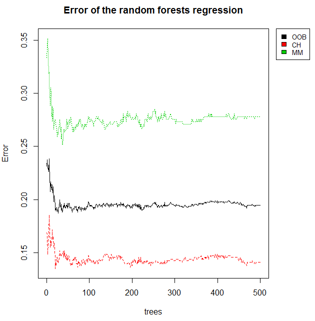

## Tree_OJ


{{ include Metainfo.html }}


 
 
 
```R
# clear variables and close windows
rm(list = ls(all = TRUE))
graphics.off()

# install and load packages
libraries = c("tree", "ISLR", "randomForest")
lapply(libraries, function(x) if (!(x %in% installed.packages())) {
    install.packages(x)
})
lapply(libraries, library, quietly = TRUE, character.only = TRUE)

# OJ Dataset from the ILSR Package. The data contains 1070 purchases 
# where the customer either purchased Citrus Hill or Minute Maid 
# Orange Juice. A number of characteristics of the customer and product
# are recorded.
data(OJ)
OJ = data.frame(OJ)

# Build a Tree Model with all Regressors to fit Purchase (can either by MM or CH)
tree.oj = tree(Purchase ~ ., OJ)
summary(tree.oj)     # summary of the Classification tree

# Plot 1: Tree Model
plot(tree.oj)
title(paste("Fit of the Regression Tree"))
text(tree.oj)

# Plot 2: Error of the random forests regression
dev.new()
random.oj = randomForest(Purchase ~ ., OJ)
layout(matrix(c(1,2),nrow=1),
       width=c(4,1)) 
par(mar=c(5,4,4,0)) # No margin on the right side
plot(random.oj, main = "Error of the random forests regression")
par(mar=c(5,0,4,2)) # No margin on the left side
plot(c(0,1),type="n", axes=F, xlab="", ylab="")
legend("top", colnames(random.oj$err.rate),col=1:4,cex=0.8,fill=1:4)

# Summary of the random forests regression
print(random.oj)
summary(random.oj) # technical details of the random forests regression
 
```
