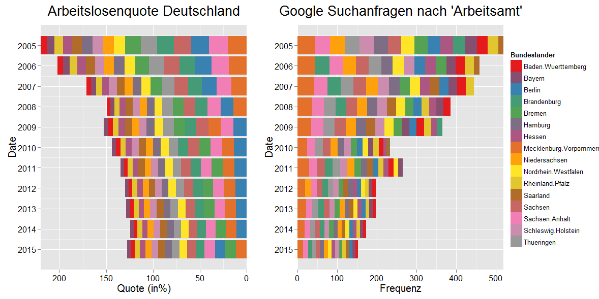

## Unemployment_Google_vs_Official

 

 
```R

install.packages("ggplot2")
install.packages("reshape2")
install.packages("gridExtra")
install.packages("grid")
install.packages("RColorBrewer")

library(RColorBrewer)
library(gridExtra)
library(ggplot2)
library(reshape2)

# Date is a data.frame but with Factors 
UnempM <- read.csv("Arbeitslosenquote_Bundeslaender_13211-0008.csv",header=TRUE,sep=";",dec=",",stringsAsFactors=TRUE)
UnempJ <- read.csv("Arbeitslosenquote_Bundeslaender_year.csv",header=TRUE,sep=";",dec=",",stringsAsFactors=TRUE)
Google_Unemp  <- read.csv("Google_Arbeitsamt_Bundeslaender_monthly.csv",header=TRUE,sep=";",dec=",",stringsAsFactors=TRUE)
Google_Unemp_J <- read.csv("Google_Arbeitsamt_Bundeslaender_year.csv",header=TRUE,sep=";",dec=",",stringsAsFactors=TRUE)

# some data frame transformations
Google_Unemp_M <- melt(Google_Unemp_J,id.var="Date")
str(Google_Unemp_M)
Unemp_M <- melt(UnempJ,id.var="Date")
str(Google_Unemp_M)

#### GG Plot - Säulendiagramm Gestapelt
# specify Colors
getPalette = colorRampPalette(brewer.pal(9, "Set1"))

# Google "Arbeitsamt"
Gplot_GoogleA <- ggplot(Google_Unemp_M,aes(x=Date, y=value, fill=variable, order=-as.numeric(value))) +
  geom_bar(stat="identity", position = "stack") +
  coord_flip() + scale_fill_manual(values = getPalette(16), guide_legend(title="Bundesländer")) +
  scale_y_continuous(expand = c(0,0)) + scale_x_reverse(breaks=2005:2015) +
  ggtitle("Google Suchanfragen nach 'Arbeitsamt'") + ylab("Frequenz") +
  theme(axis.text = element_text(size = 12))

# Arbeitslosenquote Deutschland nach Bundesländern
Gplot_Unemp <- ggplot(Unemp_M,aes(x=Date, y=value, fill=variable, order=-as.numeric(value))) +
  geom_bar(stat="identity", position = "stack") +
  coord_flip() + scale_fill_manual(values = getPalette(16), guide_legend(title="Bundesländer")) +
  scale_y_continuous(trans = "reverse",expand = c(0,0)) + scale_x_reverse(breaks=2005:2015) +
  ggtitle("Arbeitslosenquote Deutschland") + theme(legend.position="none") +
  guides(fill=guide_legend(nrow=3,byrow=TRUE)) + ylab("Quote (in%)") +
  theme(axis.text = element_text(size = 12, color= "black")) + theme(axis.title = element_text(size=15)) +
  theme(axis.text.y = element_text(size = 12, color= "black")) + theme(axis.title.y = element_text(size=15)) +
  theme(plot.title = element_text(size = 20, vjust=2))

# Gemeinsamme Legende
#1.Schritt: Funktion zum speichern der Legende. Nur der Legende
g_legend <- function(a.gplot){
  tmp <- ggplot_gtable(ggplot_build(a.gplot))
  leg <- which(sapply(tmp$grobs, function(x) x$name) == "guide-box")
  legend <- tmp$grobs[[leg]]
  return(legend)
}

# 2. Schritt: Legende aus dem Plot extrahieren - Ergebnis ist nur die Legende
leg<-g_legend(Gplot_GoogleA)

# 3. Schritt: Legende aus Google Plot entfernen
Gplot_GoogleA_oL <- ggplot(Google_Unemp_M,aes(x=Date, y=value, fill=variable, order=-as.numeric(value))) +
  geom_bar(stat="identity", position = "stack") + coord_flip() +
  scale_fill_manual(values = getPalette(16), guide_legend(title="Bundesländer")) +
  scale_y_continuous(expand = c(0,0)) + scale_x_reverse(breaks=2005:2015) +
  ggtitle("Google Suchanfragen nach 'Arbeitsamt'") + theme(legend.position="none") +
  ylab("Frequenz") + theme(axis.text = element_text(size = 12, color= "black")) +
  theme(axis.title = element_text(size=15)) + theme(axis.text.y = element_text(size = 12, color= "black")) +
  theme(axis.title.y = element_text(size=15)) + theme(plot.title = element_text(size = 20, vjust=2))
  #guides(fill=guide_legend(nrow=3,byrow=TRUE))

#4.Schritt: Graphen Plotten und Legende einfügen. 
grid.arrange(arrangeGrob(Gplot_Unemp,Gplot_GoogleA_oL,leg ,ncol=3,widths=c(3/7,3/7,1/7)))

```
